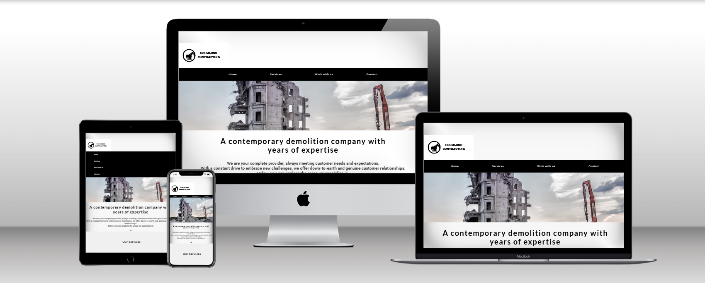
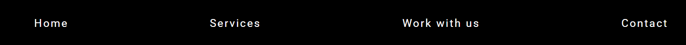
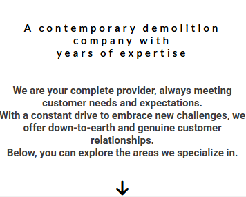

# Holmlund Contracting

Welcome to Holmlund Contracting!
Thank you for visiting my project. 

Live Demo
 https://github.com/bjoernholmlund/Bbygg.git

## Features

## Existing Features
 - **Home button:** 
 
 

 - **Menulist:** 
 
 

 - **Information**
 
 
 

## 🌟 Functions  
- **Responsive design:** Adapts to all screen sizes.  
- **Easy Navigation:** Intuitive interface for efficient use.  
- **Fast loading times:** Optimized for performance.

## 🚀 Get started  
Follow the steps below to run the project locally: 

## Overview
This site is designed to showcase our expertise and commitment to delivering 
top-quality construction and contracting services. Explore our features and learn more 
about how we strive to provide innovative and user-friendly solutions for every project.
## ⚙️ Technologies used
- **HTML**  
- **CSS**  

Testing

Manual Testing
What will be tested 
 
HTML No errors were returned when passing through the official W3C validator. The results for the individual HTML files are below.
- index.html
- service.html
- demolition.html
- dismantling.html
- excavation.html
- milling.html
- sheet-piling.html
- work-with-us.html

CSS No errors were returned when passing through the official W3C (Jigsaw) validator.
Deployment

Credits
