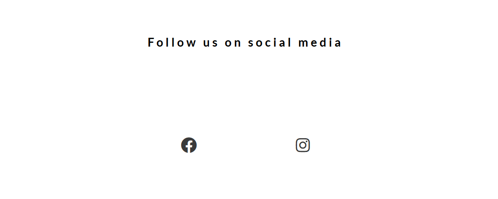
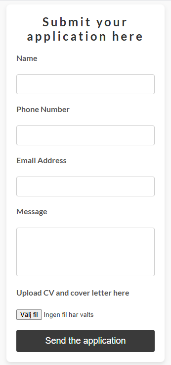

# Holmlund Contracting

Welcome to Holmlund Contracting!
A sleek and user-friendly website designed to showcase our services in construction and contracting. 
This site is built to offer a seamless experience while highlighting professionalism and innovation. 
Below are the key features of the website:

## Live Demo
 
<a href="https://bjoernholmlund.github.io/Bbygg/">Page</a>

## Features

 - **Home button/Logo:** 
 
 

 - **Menulist:** 
 
 

 - **Information**
 
   Some information on every site you visit.

 

 - **Footer**
 
 
 
 - **Form**
 
    
 

## ⚙️ Technologies used
- **HTML**  
- **CSS**  

## Testing

   - Cross-Browser Testing: I tested the game across multiple web browsers, including Firefox, Chrome, Opera, and Safari. The game functioned as expected on each, with no issues in game logic, visuals, or interactivity.

   - I have verified that this project is fully responsive, visually appealing, and functions correctly across all standard screen sizes using the DevTools device toolbar.

   - I confirmed that the navigation, header, services, work with us and contact us pages are all readable and easy too understand.

   - I have confirmed that both forms works properly, requires entries in every field, will only accept an email in the email field, and the submit button works. 

## Bug

Layout Issues on Smaller Screens

- Description: 
   On smaller screens, the layout became distorted with text overlapping images and sections exceeding the viewport, making navigation and readability difficult.

- Expectation:
   The layout should adapt seamlessly to smaller screens, keeping all elements properly aligned without overlaps or scrolling issues.

- Experience:
   Users faced usability problems on small devices due to a broken and unprofessional-looking layout.

- Cause:
   The CSS lacked responsive breakpoints, and certain elements had fixed widths or margins that didn’t adjust for different screen sizes.
 
## Validator Testing 

* **HTML** 
   - No errors were returned when passing through the official W3C validator.

- **CSS** 
   - No errors were returned when passing through the official W3C (Jigsaw) validator.

+ **Accessibility**
   - I confirmed that the colors and fonts chosen are easy to read and accessible by running it through lighthouse in devtools. 

## Deployment

   - The site was deployed to GitHub pages. The steps to deploy are as follows:
      - In the GitHub repository, navigate to the Settings tab
      * From the source section drop-down menu, select the Master Branch
      + Once the master branch has been selected, the page will be automatically refreshed with a detailed ribbon display to indicate the successful deployment.

## Credits

Content

   - Coding references and tips from [W3Schools](https://www.w3schools.com), and [GeeksforGeeks](https://www.geeksforgeeks.org).  

Media
   
   - Pixabay Images: Several images used on this website are sourced from [Pixabay](https://pixabay.com/), a platform that provides high-quality, royalty-free images.
   - Private Images: Additionally, the website features private photographs taken personally.